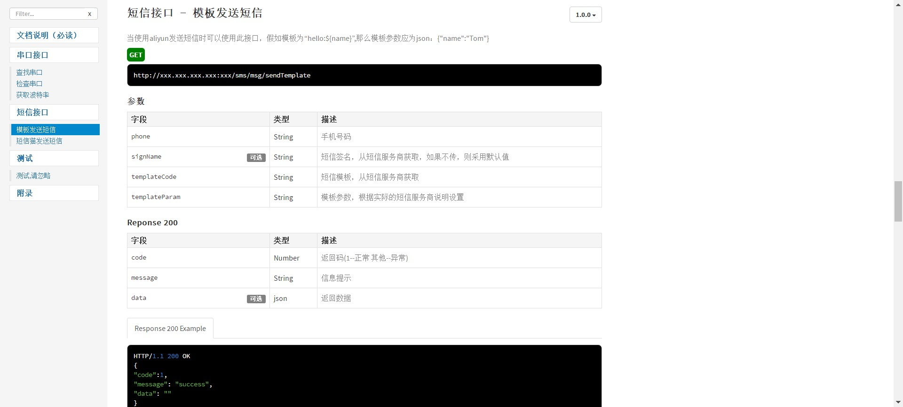

# 开发运行环境
* Windows 10 64bit
* IntelliJ IDEA 2017.2
* SpringBoot 2.0.x
* gradle 4.8.x
* jdk1.8

# 说明
* 本工程是一个跟业务无关的通用短信服务
* 本工程可作为短信猫二次开发的一个参考工程
* 如果你使用短信猫来发送短信，那么本工程免去了大部分的开发工作，直接配置好短信猫的信息即可使用
* 如果你使用阿里云的短信，那么只要配置好密钥模板等相关信息即可使用
* 本工程提供友好的在线接口访问（使用apidoc）
* [短信猫二次开发(java版)](https://blog.csdn.net/huweijian5/article/details/82658865)

# 注意
* 本工程暂时只支持windows环境运行，linux未测试
* 本工程集成了[apidoc](http://apidocjs.com/)
* 本工程集成了eureka客户端功能，actuator监控功能，如不需要直接剔除即可

# 打包
* 打包命令(也可直接执行package.bat,之后在build/libs下可查看到打包好的jar)：gradle build -x test
* 或者在IDEA右侧的gradle的Tasks下的build的build任务也可打成jar包

# 访问
* 服务启动后访问以下地址进入首页，ip和端口根据实际情况修改
* http://localhost:port/sms/
* 

# apidoc:
* step1:参照官网安装好node.js环境：http://apidocjs.com/
* step2:在根目录下的apidoc.json和apidoc/header.md apidoc/footer.md common.js四个文件可进行相关配置
* step3:使用apidoc/generate_apidoc.bat可生成apidoc在线文档
* 文档存放在src/main/resources/static/apidoc下

